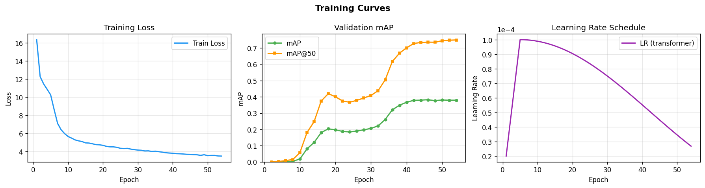

# Visual-Recognition-using-Deep-Learning-HW2
## Introduction
This project implements a **DEtection TRansformer (DETR)** model for
digit detection (digits 0-9). The architecture is designed to meet
specific academic constraints where only the backbone utilizes
pretrained weights.

### Key Implementation Details
* **Backbone**: ResNet-50 using pretrained weights from torchvision.
* **Transformer**: Both Encoder (6 layers) and Decoder (3 layers) are
initialized from scratch and trained specifically for this task.
* **Optimization**: Optimized for NVIDIA RTX 4090 performance using
Automatic Mixed Precision (AMP) and Gradient Accumulation.
* **Augmentation**: A robust pipeline using `Albumentations` including
Gaussian Noise, Affine transformations, and Random Shadows.

---

## Environment Setup

### Prerequisites
* **Python**: 3.10+
* **GPU**: NVIDIA GPU with CUDA support (e.g., RTX 4090)

### Installation
1. **Installation:**
```bash
pip install -r requirements.txt
```

2. **Data Organization**:
Ensure your dataset is structured in the `./data` directory as follows:
```text
./data/
├── train/ # Training images
├── valid/ # Validation images
├── test/ # Test images
├── train.json # Annotations in COCO format
└── valid.json
```

---

## Usage

The script utilizes environment variables for configuration and
execution modes.

### 1. Training Mode
To start the training process (default):
```bash
python hw2.py
```
* **Backbone Freezing**: The backbone remains frozen for the first 5
epochs.
* **Checkpoints**: The best model is saved to `./best_model_hw2`.
Periodic checkpoints are saved every 5 epochs.

* **Visualization**: Training curves (Loss, mAP, LR) are automatically
updated in `training_curve.png`.

### 2. Prediction Mode
To generate predictions on the test set and export them to `pred.json`:
```bash
RUN_MODE=predict python hw2.py
```

### 3. Evaluation Mode
To evaluate the saved checkpoint against the validation set:
```bash
RUN_MODE=eval python hw2.py
```

---

## Performance Snapshot

* **Training Configuration**:
* **Batch Size**: 12 (Effective batch size of 24 via 2-step
gradient accumulation).
* **Learning Rate**: 1e-4 for the Transformer and 1e-5 for the
Backbone.
* **Scheduler**: Linear warmup (5 epochs) followed by Cosine Decay.
* **Inference Parameters**:
* **Prediction Threshold**: 0.05.
* **Top-K Detections**: Limits output to the top 30 scoring boxes
per image.

---

### Academic Integrity Statement
This implementation strictly follows the &quot;backbone-only pretrained&quot;
rule. The Transformer encoder and decoder layers are initialized with
random weights and do not inherit parameters from any pretrained DETR
checkpoints.
